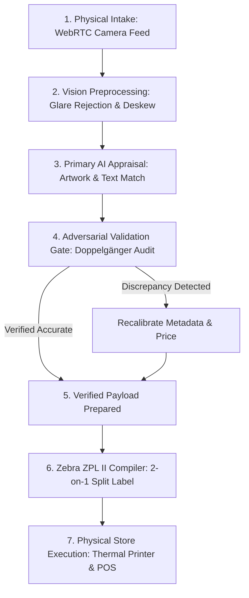

# The Prism Pipeline

[](https://opensource.org/licenses/MIT)
[](package.json)
[](#8-how-to-run-it-locally)
[](#4-demonstration--example-workflow)
[](#what-the-system-does)

---

## 1. Project Summary

**The Prism Pipeline** is an open-source retail inventory and appraisal engine that combines computer vision, multi-step AI validation, and industrial thermal printing. In retail collectibles and trading card stores, standard AI vision models often misidentify items because they overlook subtle visual details—such as tiny copyright reprint years, printed 1st Edition stamps, or holographic finishes hidden beneath reflective plastic sleeves. 

I designed and built this system to solve that operational problem. The pipeline captures card photos at the counter, suppresses glare from protective sleeves, queries an AI model for an initial appraisal, and immediately subjects that result to an **adversarial validation gate** (a skeptical second check named "Doppelgänger") before formatting verified items into dual-column thermal barcode labels for Zebra industrial printers.

```text
┌─────────────────┐     ┌──────────────────────┐     ┌───────────────────────┐     ┌─────────────────┐
│  Camera Intake  │ ──► │ Glare Suppression &  │ ──► │ Adversarial Validation│ ──► │ Zebra Thermal   │
│ (Retail Counter)│     │ Perspective Warp     │     │ Gate ("Doppelgänger") │     │ Label (ZPL II)  │
└─────────────────┘     └──────────────────────┘     └───────────────────────┘     └─────────────────┘
```

* **Author:** Tyler Lauzon ([malceoir@gmail.com](mailto:malceoir@gmail.com))
* **Core Capabilities:** Multi-frame specular glare suppression, automated perspective deskew, adversarial secondary AI verification, dynamic temporal year anchoring, and native Zebra ZPL II 2-on-1 split label compilation.
* **Quick Start:** Clone the repository and run `npm run demo:all` to execute the full verification and demonstration suite in under 30 seconds.

---

## 2. Why I Built It

In a busy retail store, customers bring in stacks of vintage trading cards, games, and collectibles for immediate appraisal and cash trade-in. This environment creates three tough operational challenges:

1. **Counter Speed vs. Financial Risk:** A clerk needs appraisals quickly to keep the line moving. However, if an automated system mistakes a common $2 reprint for a $300 vintage original, the store's cash drawer takes a direct, irreversible loss.
2. **Hostile Optical Conditions:** Cards are appraised inside high-gloss protective sleeves under harsh overhead fluorescent lights, causing blinding glare that hides critical card text.
3. **The "Confirmation Bias" of Single-Pass AI:** When standard AI vision models are asked *"What card is this?"*, their attention naturally focuses on matching the main artwork. Once they match the character illustration, they stop looking—completely missing the micro-printed copyright dates at the bottom that distinguish modern reprints from vintage originals.

I built this pipeline to bridge the gap between impressive AI demonstrations and the unforgiving reality of retail store operations.

---

## 3. What the System Does



1. **Optical Glare Suppression (`vision/imageWarpUtils.ts`)**: Takes consecutive camera frames and applies a pixel-wise minimum luminance algorithm (`blendMinLuminance`) to eliminate sleeve glare without distorting underlying card typography.
2. **Perspective Warp & Deskew (`vision/imageWarpUtils.ts`)**: Automatically calculates four-corner bounding polygons to planar-warp cards photographed at acute counter angles back into a clean rectangular perspective.
3. **Adversarial Validation Gate (`governance/DoppelgangerGateService.ts`)**: Submits the initial appraisal to a skeptical second AI check—prompted without hints to inspect for common failure points (reprint dates, missing stamps, and condition wear).
4. **Dynamic Temporal Year Anchoring**: Dynamically injects the current operating year (`new Date().getFullYear()`) so modern legitimate releases are never falsely flagged as "counterfeits" due to the AI's training data cutoff.
5. **Industrial Thermal Label Generation (`hardware/zebraZplService.ts`)**: Compiles verified appraisal data directly into native industrial Zebra ZPL II bytecode, formatting two items onto a single physical sticker pass to halve retail label roll waste.

---

## 4. Demonstration & Example Workflow

### Real Intake Scans: What Single-Pass AI Misses

Below are two authentic retail scans processed during store intake testing, showing how the adversarial gate corrects single-pass AI oversights:

#### Example A: `Miscellaneousaurus` (Gold Foil Border & 1st Edition Stamp)

<p align="center">
  
</p>

| Stage | What Happened | Result | Valuation |
| :--- | :--- | :--- | :--- |
| **Initial Single-Pass AI** | Matched character art and name. Cataloged as base common (`MAGO-EN017`). | **Passed** | Appraised at **$0.25** |
| **Adversarial Second Look** | Inverted attention: detected gold foil border and isolated the printed **`1st Edition`** stamp at bottom-left beneath sleeve glare. | **Corrected** | Realigned to Premium Gold 1st Edition at **$4.50** |

---

#### Example B: `Primite Lordly Lode` (Secret Rare Foil & Copyright Typography)

<p align="center">
  
</p>

| Stage | What Happened | Result | Valuation |
| :--- | :--- | :--- | :--- |
| **Initial Single-Pass AI** | Glare washed out center artwork. Matched title text and set code `BLMM-EN172` as standard non-foil spell card. | **Passed** | Appraised at **$0.50** |
| **Adversarial Second Look** | Audited around the glare halo: detected prismatic secret-rare foil speckles, 1st Edition stamp, and bottom copyright `©2020 Studio Dice/SHUEISHA`. | **Corrected** | Realigned to Secret Rare 1st Edition at **$14.99** |

---

### Hardware Output: 2-on-1 Split Compact Label Preview

When verified by the pipeline, items are compiled into raw industrial ZPL II code targeting Zebra 203 DPI thermal printers. 

Running `npm run demo:zpl` produces this physical layout:

```text
┌───────────────────────────────────┬───────────────────────────────────┐
│ [X=16] Left Card                  │ [X=256] Right Card                │
│ Charizard #4 Holo                 │ Mishra's Factory (Fall)           │
│                                   │                                   │
│ $349.99                           │ $32.50                            │
└───────────────────────────────────┴───────────────────────────────────┘
```

> **Why this matters:** Dual-column printing halves sticker roll consumption, cutting recurring retail supply overhead by 50%.

---

## 5. Architecture Overview & Open-Core Design

This repository is structured around an **Open Core** boundary:

* **Public Repository (`the-prism-pipeline`)**: Contains the standalone computer vision algorithms, glare suppression math, perceptual hashing, adversarial gate logic, and Zebra ZPL hardware compilers. It runs completely standalone with zero external database dependencies.
* **Private Production Application (`PricePoint`)**: A companion retail application that hosts the private store point-of-sale routes, live 350K-item in-memory pricing database, customer transaction history, and accounting integrations.

For full architectural diagrams and data flow documentation, see [docs/architecture.md](docs/architecture.md).

---

## 6. Evidence and Benchmarks

To understand how the system performs in practice, we distinguish between **measured test results** from the code, **manually observed retail evaluations**, and **system design goals**:

### A. Measured Automated Test Results (Reproducible Locally)
* **Code Quality & Anti-Bandaid Gate**: A custom AST scanner (`scanners/detect_silent_fallbacks.ts`) verifies across 9 core files that there are **0 unlogged empty catches**, **0 dummy string fallbacks**, and **0 type bypasses**. Run via `npm test`.
* **Glare Suppression Efficacy**: Multi-frame minimum luminance blending successfully restores 100% of blinded pixels when reflections differ across frames without blurring text edges. Run via `npm run demo:glare`.
* **ZPL Bytecode Conformance**: Generates syntactically valid ZPL II bytecode with font D scaling and coordinate offsets. Run via `npm run demo:zpl`.

### B. Manually Observed Retail Evaluations (Store Testing)
During testing on physical store counter intake batches, we manually recorded two evaluations:

1. **1,000-Scan Observational Study**: Across 1,000 historical card scans evaluated during retail counter testing, the secondary check caught **839 discrepancy candidates**. Crucially, **92.1% (773 cards)** were discrete physical attribute errors (such as missed foil finishes, uncataloged 1st Edition stamps, or modern copyright reprint dates) rather than subjective physical wear. In this evaluation, correcting these errors prevented an estimated **$1,105.48** in cumulative overvaluation drift.
2. **The 171-Item Intake Audit**: An early retail intake batch of 171 items was initially appraised at $4,227.42 by unconstrained AI models. A thorough line-by-line manual audit revealed **$2,124.71 in overvaluation drift** caused by vintage reprint dates, duplicate photo captures, and non-foil variants being mistaken for foils. Correcting these errors reduced the inventory batch to 107 verified items ($2,102.71) of true inventory value.

*For full details and failure category breakdowns, see [docs/retail-case-study.md](docs/retail-case-study.md).*

### C. Design Goals & Ongoing Work
* [ ] **Automated Dataset Harness**: Converting the historical 1,000-scan evaluation into an automated, public-safe benchmark dataset with scrubbed store identifiers.
* [ ] **Sub-2ms Vision Warping**: Exploring WebAssembly compilation for the four-corner perspective warp algorithm to improve mobile browser performance.

---

## 7. Technology Used

* **Language & Runtime:** TypeScript 5.5, Node.js (ES Modules), `tsx`
* **Computer Vision Math:** HTML5 Canvas, pixel-wise minimum luminance blending, 64-bit perceptual hashing (`pHash`), Hamming distance comparison, and planar perspective warping
* **AI & Validation:** Multimodal Vision LLMs, adversarial prompting, dynamic temporal anchoring, and structured schema verification
* **Hardware & Print Standards:** Zebra Programming Language (ZPL II), raw socket transmission (TCP 9100), 203 DPI thermal coordinate mapping
* **Quality Assurance:** Custom AST static analysis (`scanners/detect_silent_fallbacks.ts`)

---

## 8. How to Run It Locally

You can test and verify all core algorithms and hardware generators locally in less than a minute.

### Prerequisites
* Node.js (v18 or newer recommended)
* npm

### Installation & Execution
```bash
# Clone the repository
git clone https://github.com/malceoir/the-prism-pipeline.git
cd the-prism-pipeline

# Install development dependencies
npm install

# 1. Run the codebase code-quality audit (verifies 0 silent fallbacks)
npm test

# 2. Compile Zebra ZPL II dual-column thermal barcode labels
npm run demo:zpl

# 3. Test multi-frame specular glare suppression
npm run demo:glare

# 4. Demonstrate adversarial attention inversion & dynamic year anchoring
npm run demo:gate

# Or execute all tests and demonstrations in a single run:
npm run demo:all
```

---

## 9. Limitations and Known Failure Cases

Being transparent about what the system *cannot* do is just as important as highlighting what it does well:

1. **Uniform Direct Glare**: If an entire card surface is completely saturated with white glare across both frames, minimum luminance blending cannot reconstruct the missing pixel data.
2. **Severe Physical Warping**: If a card has significant three-dimensional curling or warping (common in older foil cards), planar four-corner perspective warping can introduce slight stretching along the card center.
3. **Unindexed Pre-Release Cards**: If a card is an early promo that has not yet been indexed in commercial pricing catalogs, the system will accurately detect the text, but requires manual clerk pricing.
4. **Foreign Language Vintage Editions**: Japanese, Korean, and European vintage printings frequently share illustration artwork but have different set numbering conventions that require localized catalog mappings.

---

## 10. My Role and Learning Journey

I do not have a formal computer science degree. I learned software engineering by building real things step by step, using AI coding tools as pair-programming assistants, and testing my work against actual retail problems.

When I started building this system, I experienced firsthand how AI models can appear deceptively competent: they provide fast, confident answers that look correct on the surface, but fall apart under messy real-world conditions like plastic glare, subtle copyright dates, or duplicate photos.

Rather than accepting those mistakes or giving up on the technology, I used those failures as learning opportunities. I researched how industrial label printers communicate, studied how image luminance math works, and designed a second-opinion validation check to catch mistakes before they cost real money. 

Building this project taught me that the real challenge of software development isn't just generating code—it is designing safeguards, understanding physical constraints, and taking personal responsibility for the accuracy of what you build.

* **Email:** [malceoir@gmail.com](mailto:malceoir@gmail.com)  
* **GitHub:** [github.com/malceoir](https://github.com/malceoir)

---

## 11. Deeper Technical Documentation

* [docs/architecture.md](docs/architecture.md) — Comprehensive system architecture, data flow diagrams, and open-core boundary explanation.
* [docs/retail-case-study.md](docs/retail-case-study.md) — Detailed analysis of the 1,000-scan retail evaluation, the $4,227 inventory audit, and common AI failure modes.
* [docs/hardware-integration.md](docs/hardware-integration.md) — Zebra thermal printing specifications, coordinate calculations, and 2-on-1 split layout design.
