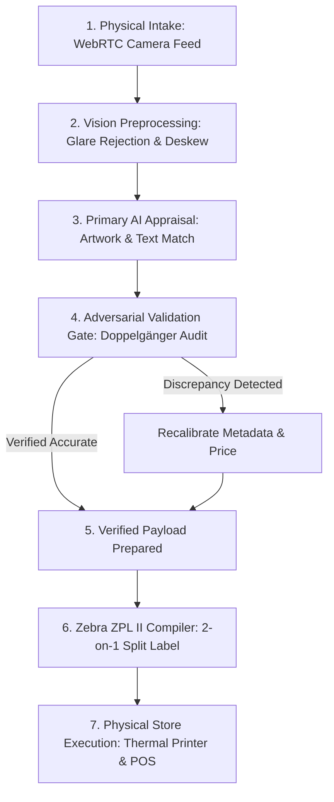

# System Architecture & Technical Design

This document details the software architecture, data flow, and modular boundaries of **The Prism Pipeline**.

---

## 1. System Overview & The "Open Core" Model

The system is designed around an **Open Core** architecture. This pattern separates the reusable, mathematically rigorous core logic from proprietary business data:

```
┌────────────────────────────────────────────────────────────────────────┐
│                   PUBLIC REPOSITORY: The Prism Pipeline                │
│                                                                        │
│  • Computer Vision: Perspective warp, deskew & multi-frame glare math  │
│  • Perceptual Hashing: Image deduplication via pHash & Hamming distance│
│  • Adversarial Validation: Secondary "Doppelgänger" evaluation gate    │
│  • Hardware Compilers: Raw Zebra ZPL II 2-on-1 dual-sticker generator  │
│  • Quality Gates: AST static analysis for anti-bandaid / fallback bans │
└───────────────────────────────────┬────────────────────────────────────┘
                                    │ Evaluated & Formatted Payloads
                                    ▼
┌────────────────────────────────────────────────────────────────────────┐
│                   PRIVATE PRODUCTION APP: PricePoint                   │
│                                                                        │
│  • Live 350K+ In-Memory TCGPlayer catalog database                     │
│  • Real-time secondary market price scrapers & competitor trackers     │
│  • Point-of-Sale (POS) integration & SQLite transaction buffer         │
│  • Customer trade-in credit accounting & financial payout rules        │
│  • Store register authentication & physical scanner WebRTC interface   │
└────────────────────────────────────────────────────────────────────────┘
```

### Why Separate the Core from the Production App?
1. **Security & Privacy**: Protects store transactional history, customer information, private API keys, and commercial trade margins.
2. **Modular Reusability**: The vision filters, adversarial verification logic, and Zebra ZPL compilers are cleanly separated and can be run standalone or integrated into other warehouse and inventory tools.
3. **Reproducibility**: Anyone can clone this repository, run the test suites, and execute the demonstration scripts without needing access to a private retail database.

---

## 2. Multi-Stage Pipeline Data Flow

When a physical collectible (such as a trading card or game cartridge) is appraised at the counter, it passes through five distinct stages:



---

## 3. Component Deep Dive

### Stage 1: Vision Preprocessing (`vision/imageWarpUtils.ts`)
* **Perspective Warping (`warpPerspective`)**: When a clerk photographs a card at an angle, the four corners are mapped to a clean rectangular coordinate space ($W \times H$).
* **Multi-Frame Glare Neutralization (`blendMinLuminance`)**: Plastic protective sleeves reflect overhead fluorescent lights. By taking two rapid frames where the light reflects in different areas and computing pixel-wise minimum luminance:
  $$\text{Pixel}_{\text{out}}(x,y) = \min(\text{Frame}_1(x,y), \text{Frame}_2(x,y))$$
  The glaring white reflection is suppressed without blurring underlying typography or card borders.

### Stage 2: Perceptual Hashing & Duplicate Detection (`vision/pHashService.ts`)
* Generates a 64-bit perceptual hash (`computePHash`) from a normalized $32 \times 32$ luminance grid.
* Compares incoming frames against recent captures using **Hamming Distance**. If two photos taken seconds apart have a Hamming distance $\le 5$, the system flags a duplicate capture, preventing double-entry in the store inventory.

### Stage 3 & 4: Primary Appraisal & The Adversarial Validation Gate (`governance/DoppelgangerGateService.ts`)
* Standard AI vision models often stop looking once they match the primary artwork.
* The **Doppelgänger Gate** acts as an automated second opinion. It inverts the evaluation by prompting a secondary model with deliberate skepticism:
  > *"A retail appraiser suspects there may be an error in this candidate appraisal. Review the image carefully: are there reprint dates, missing stamps, or finish discrepancies?"*
* **Dynamic Temporal Anchoring**: Prevents the AI from hallucinating that new releases are "counterfeits" simply because their copyright date is past the AI model's training cutoff. The system dynamically injects the current operating year (`new Date().getFullYear()`) as the temporal baseline.

### Stage 5: Industrial Label Generation (`hardware/zebraZplService.ts`)
* Converts verified appraisal data into native **Zebra Programming Language (ZPL II)**.
* **The 2-on-1 Split-Compact Layout**: Instead of printing one large sticker per card, it formats two separate inventory entries side-by-side ($X=16$ and $X=256$) onto a single $60\text{mm} \times 25\text{mm}$ thermal label roll at 203 DPI.
* Reduces thermal label roll consumption by 50% in daily retail operations.

### Stage 6: Code Quality & Zero-Fallback Enforcement (`scanners/detect_silent_fallbacks.ts`)
* A custom Abstract Syntax Tree (AST) scanner parses all repository files for anti-patterns:
  - Empty `catch (_) {}` blocks
  - Masking errors with unlogged dummy strings (e.g. `"Unknown Set"`)
  - Type escape hatches (`as any`)
* Ensures that errors are surfaced explicitly rather than quietly ignored.
